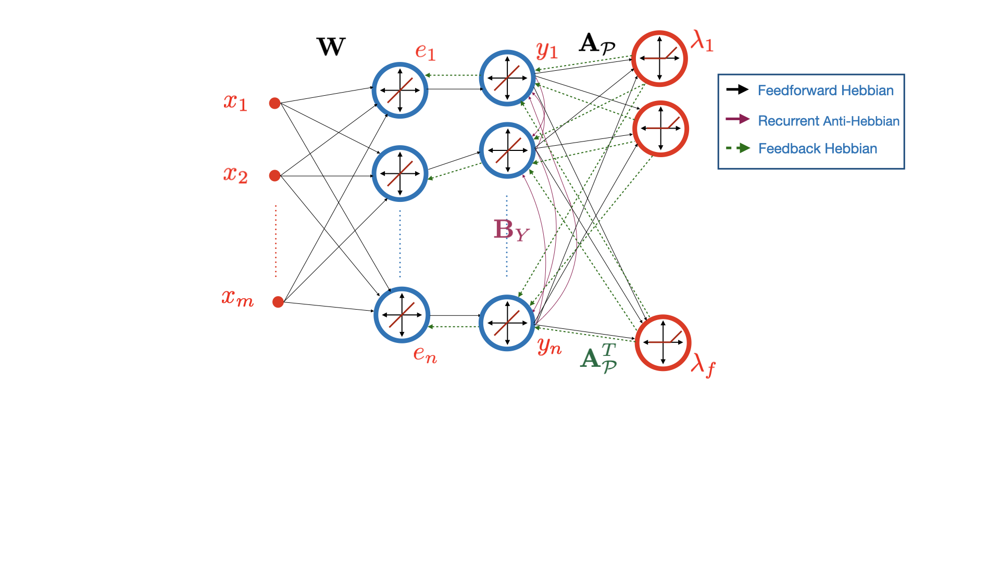
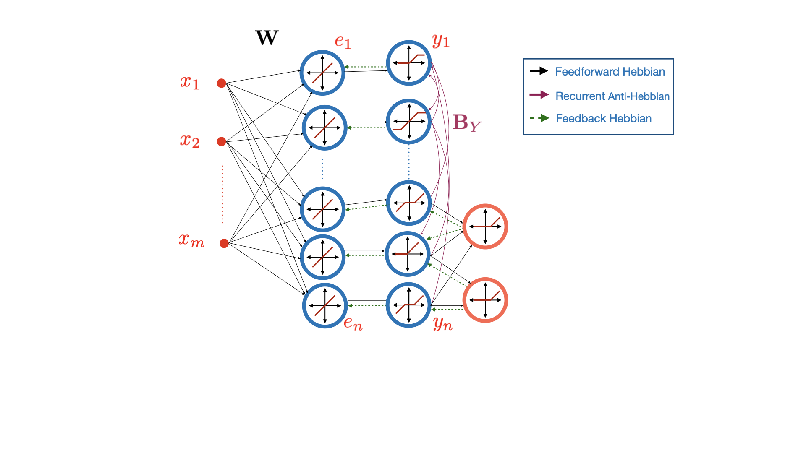

# Correlative Information Maximization Based Biologically Plausible Neural Networks for Correlated Source Separation

This Github repository includes the implementation of the Correlative Information Maximization Based Biologically Plausible Neural Networks for Correlated Source Separation, which is submitted to ICLR 2023. All the codes are written in Python 3. This paper proposes biologically plausible neural networks for blind separation of correlated sources exploiting prior domain assumptions via an information maximization criterion.

## CorInfoMax Neural Networks

CorInfoMax NN for Canonical Polytope Representation  |  CorInfoMax NN for "Feature-Based" Polytope Representation
:-------------------------:|:-------------------------:
   |  

## Simulations In the Paper

All the simulation codes for the paper manuscript are included inside the folder "Simulations". The subfolders are named accordingly, e.g., "SparseNoisy" folder contains the experiments for the sparse source separation simulations in the paper. The jupyter notebooks inside the folder "Simulations/AnalyzeSimulationResultsFinal" illustrates the plots and tables presented in the paper. For example, the notebook "PlotSimulationResults_GeneralPoly.ipynb" includes the plots for the Appendix D.2.4. To replicate the figures in this specific notebook, you need to follow the below steps,

 * Run both python scripts in the folder "Simulations/GeneralPolytope" with the following commands:

    ``` python CorInfoMax_GeneralPolytope5dimV2.py```

    ``` python CorInfoMax_GeneralPolytope5dimV3.py```

 * When you run these python simulations, the following two pickle files will be created which contains the SINR results of each algorithm. 
    * "Simulations/Results/simulation_results_general_polytope_5dimV2.pkl"
    * "Simulations/Results/simulation_results_general_polytope_5dimV3.pkl"

 * The jupyter notebook "Simulations/AnalyzeSimulationResultsFinal/PlotSimulationResults_GeneralPoly.ipynb" reads the above pickle files and visualize the results. Moreover, the performances of the baseline algorithms are also reported.

To replicate each simulation in the paper, you can adapt the above procedure for the other sections (for antisparse, sparse, and simplex blind source separation (BSS) simulations). The experiment procedure for video separation is included in "Simulations/VideoSeparation" as a separate readme file. The sparse dictionary learning experiment is located in "Simulations/SparseDictionaryLearning", and the notebook inside this folder produces the sparse receptive fields from prewhitened Olshaussen's image pathces (you need "imagepatcheselfwhitened.mat" file whereas it is not included here due to its file size).

# Python Version and Dependencies

* Python Version: Python 3.8.12

* pip version : 21.2.4

* Required Python Packages: Specified in requirements.txt file.

* Platform Info : "OS: Linux (x86_64-pc-linux-gnu) CPU: Intel(R) Xeon(R) Gold 6248 CPU @ 2.50GHz"

# Folder Contents

## src
This file is the source code for each BSS algorithm we used in the paper. The following is the full list.

* BSSbase.py            : Base class for blind source separation algorithms
* CorInfoMaxBSS.py      : Our proposed correlative information maximization (framework) neural networks 
* BCA.py                : Biologically plausible online bounded component analysis (BCA) [1] implementation
* WSMBSS.py             : Implementation of Weighted similarity mathcing-based (WSM) determinant maximization neural networks for blind separation of correlated sources [2]
* BSMBSS.py             : Implementation Bounded similarity matching (BSM) for uncorrelated antisparse sources [3]
* NSMBSS.py             : Implementation of Nonnegative similarity matching (NSM) for uncorrelated nonnegative sources [4]
* LDMIBSS.py            : Implementation of Log-det (LD-) Mutual Information maximization (LD-InfoMax) framework for blind separation of correlated sources [5](This is the batch version of our proposed online biologically plausible framework)
* PMF.py                : Implementation of Polytopic Matrix Factorization [6]
* ICA.py                : Implementation of several independent component analysis frameworks 
* bss_utils.py          : Utility functions for blind source separation experiments
* dsp_utils.py          : Utility functions for digital signal processing
* polytope_utils.py     : Utility functions for polytope operations
* visualization_utils.py: Utility functions for visualizations
* numba_utils.py        : Utility functions using numba library of Python
* general_utils.py      : Other utility functions

## Notebook_Examples
This file includes the jupyter notebook experiments of the algorithms CorInfoMax, LD-InfoMax, BCA, PMF, BSM, NSM, and ICA. The subfolder names are given accordingly, and notebooks are presented to experiment and visualize BSS settings with different algorithms. These notebooks can also be used for debugging and tutorials.

## Simulations
Each simulation presented in the paper can be reproduced using the codes in this folder.

* AntisparseCorrelated                  : (Signed) antisparse source separation simulations
* NonnegativeAntisparseCorrelated       : Nonnegative antisparse source separation simulations
* SparseNoisy                           : Sparse source separation simulations
* NNSparseNoisy                         : Nonnegative sparse source separation simulations
* SimplexNoisy                          : Simplex source separation simulations
* SparseDictionaryLearning              : Sparse dictionary learning experiment
* General_Polytope                      : A BSS simulation on a 5-dimensional identifiable polytope presented in the paper
* VideoSeparation                       : Video separation demo code
* ImageSeparation                       : Image separation demo (not presented in the paper)
* 4PAM_DigitalComm                      : A BSS simulation setting with 4PAM digital communication signals
* AblationStudies                       : Ablation studies on hyperparameter selections

* AnalyzeSimulationResultsFinal         : Producing the plots and table for simulation results

# References

[1] Berfin Simsek and Alper T. Erdogan. Online bounded component analysis: A simple recurrent
neural network with local update rule for unsupervised separation of dependent and independent
sources. In 2019 53rd Asilomar Conference on Signals, Systems, and Computers, pp. 1639–1643,
2019. doi: 10.1109/IEEECONF44664.2019.9048916.

[2] Bariscan Bozkurt, Cengiz Pehlevan, and Alper Erdogan. Biologically-plausible determinant maximization neural networks for blind separation of correlated sources. In Advances in Neural Information Processing Systems (NeurIPS), to appear, 2022.

[3] Alper T. Erdogan and Cengiz Pehlevan. Blind bounded source separation using neural networks
with local learning rules. In ICASSP 2020 - 2020 IEEE International Conference on Acoustics,
Speech and Signal Processing (ICASSP), pp. 3812–3816, 2020. doi: 10.1109/ICASSP40776.
2020.9053114.

[4] Cengiz Pehlevan, Sreyas Mohan, and Dmitri B Chklovskii. Blind nonnegative source separation
using biological neural networks. Neural computation, 29(11):2925–2954, 2017

[5] Alper T. Erdogan. An information maximization based blind source separation approach for dependent and independent sources. In ICASSP 2022 - 2022 IEEE International Conference on Acoustics, Speech and Signal Processing (ICASSP), pp. 4378–4382, 2022. doi: 10.1109/ICASSP43922.
2022.9746099.

[6] Gokcan Tatli and Alper T. Erdogan. Polytopic matrix factorization: Determinant maximization
based criterion and identifiability. IEEE Transactions on Signal Processing, 69:5431–5447, 2021.
doi: 10.1109/TSP.2021.3112918.